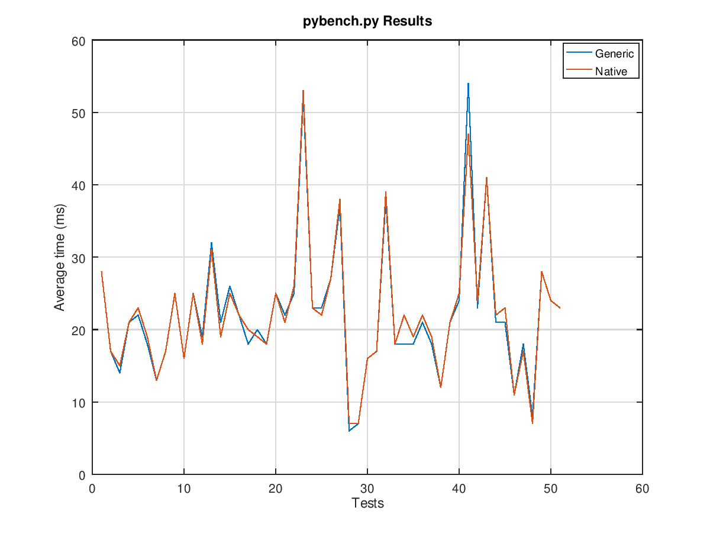

CPython Interpreter Test Results
===

pybench.py is available under the `Tools` directory of the cpython
source tree.

### [amd64] generic / native code, pybench.py

CPU: `I5-7440HQ`
Generic Version: `python3.6/unstable,unstable,now 3.6.6-4 amd64`
Native Version: ``



Generic Result
```
-------------------------------------------------------------------------------
PYBENCH 2.1
-------------------------------------------------------------------------------
* using CPython 3.6.6+ (default, Sep 1 2018, 01:05:25) [GCC 8.2.0]
* disabled garbage collection
* system check interval set to maximum: 2147483647
* using timer: time.perf_counter
* timer: resolution=1e-09, implementation=clock_gettime(CLOCK_MONOTONIC)

Calibrating tests. Please wait... done.

Running 10 round(s) of the suite at warp factor 10:

* Round 1 done in 1.132 seconds.
* Round 2 done in 1.116 seconds.
* Round 3 done in 1.124 seconds.
* Round 4 done in 1.122 seconds.
* Round 5 done in 1.119 seconds.
* Round 6 done in 1.128 seconds.
* Round 7 done in 1.133 seconds.
* Round 8 done in 1.132 seconds.
* Round 9 done in 1.128 seconds.
* Round 10 done in 1.146 seconds.

-------------------------------------------------------------------------------
Benchmark: 2018-09-11 15:24:19
-------------------------------------------------------------------------------

    Rounds: 10
    Warp:   10
    Timer:  time.perf_counter

    Machine Details:
       Platform ID:    Linux-4.17.0-3-amd64-x86_64-with-debian-buster-sid
       Processor:      
    
    Python:
       Implementation: CPython
       Executable:     /usr/bin/python3
       Version:        3.6.6+
       Compiler:       GCC 8.2.0
       Bits:           64bit
       Build:          Sep  1 2018 01:05:25 (#default)
       Unicode:        UCS4


Test                             minimum  average  operation  overhead
-------------------------------------------------------------------------------
          BuiltinFunctionCalls:     27ms     28ms    0.05us    0.078ms
           BuiltinMethodLookup:     15ms     17ms    0.02us    0.093ms
                 CompareFloats:     14ms     14ms    0.01us    0.104ms
         CompareFloatsIntegers:     20ms     21ms    0.02us    0.078ms
               CompareIntegers:     22ms     22ms    0.01us    0.157ms
        CompareInternedStrings:     18ms     18ms    0.01us    0.394ms
                  CompareLongs:     13ms     13ms    0.01us    0.091ms
                CompareStrings:     16ms     17ms    0.02us    0.264ms
    ComplexPythonFunctionCalls:     25ms     25ms    0.13us    0.130ms
                 ConcatStrings:     16ms     16ms    0.03us    0.148ms
               CreateInstances:     24ms     25ms    0.22us    0.124ms
            CreateNewInstances:     18ms     19ms    0.22us    0.092ms
       CreateStringsWithConcat:     32ms     32ms    0.03us    0.261ms
                  DictCreation:     21ms     21ms    0.05us    0.104ms
             DictWithFloatKeys:     26ms     26ms    0.03us    0.196ms
           DictWithIntegerKeys:     22ms     22ms    0.02us    0.261ms
            DictWithStringKeys:     18ms     18ms    0.02us    0.261ms
                      ForLoops:     19ms     20ms    0.78us    0.012ms
                    IfThenElse:     18ms     18ms    0.01us    0.198ms
                   ListSlicing:     24ms     25ms    1.76us    0.015ms
                NestedForLoops:     22ms     22ms    0.01us    0.001ms
      NestedListComprehensions:     25ms     25ms    2.12us    0.026ms
          NormalClassAttribute:     51ms     52ms    0.04us    0.135ms
       NormalInstanceAttribute:     22ms     23ms    0.02us    0.135ms
           PythonFunctionCalls:     22ms     23ms    0.07us    0.078ms
             PythonMethodCalls:     26ms     27ms    0.12us    0.044ms
                     Recursion:     36ms     37ms    0.73us    0.130ms
                  SecondImport:      6ms      6ms    0.06us    0.051ms
           SecondPackageImport:      6ms      7ms    0.07us    0.051ms
         SecondSubmoduleImport:     15ms     16ms    0.16us    0.051ms
       SimpleComplexArithmetic:     17ms     17ms    0.02us    0.104ms
        SimpleDictManipulation:     38ms     38ms    0.03us    0.132ms
         SimpleFloatArithmetic:     18ms     18ms    0.01us    0.156ms
      SimpleIntFloatArithmetic:     18ms     18ms    0.01us    0.156ms
       SimpleIntegerArithmetic:     17ms     18ms    0.01us    0.156ms
      SimpleListComprehensions:     21ms     21ms    1.79us    0.026ms
        SimpleListManipulation:     18ms     18ms    0.02us    0.169ms
          SimpleLongArithmetic:     12ms     12ms    0.02us    0.078ms
                    SmallLists:     20ms     21ms    0.03us    0.104ms
                   SmallTuples:     24ms     24ms    0.04us    0.117ms
         SpecialClassAttribute:     53ms     54ms    0.04us    0.136ms
      SpecialInstanceAttribute:     22ms     23ms    0.02us    0.135ms
                StringMappings:     40ms     41ms    0.16us    0.108ms
              StringPredicates:     21ms     21ms    0.03us    0.390ms
                 StringSlicing:     21ms     21ms    0.04us    0.218ms
                     TryExcept:     11ms     11ms    0.00us    0.206ms
                    TryFinally:     17ms     18ms    0.11us    0.104ms
                TryRaiseExcept:      7ms      8ms    0.12us    0.104ms
                  TupleSlicing:     27ms     28ms    0.11us    0.012ms
                   WithFinally:     23ms     24ms    0.15us    0.104ms
               WithRaiseExcept:     22ms     23ms    0.28us    0.130ms
-------------------------------------------------------------------------------
Totals:                           1104ms   1128ms
```

Native Result
```
-------------------------------------------------------------------------------
PYBENCH 2.1
-------------------------------------------------------------------------------
* using CPython 3.6.6+ (default, Sep 11 2018, 15:25:09) [GCC 8.2.0]
* disabled garbage collection
* system check interval set to maximum: 2147483647
* using timer: time.perf_counter
* timer: resolution=1e-09, implementation=clock_gettime(CLOCK_MONOTONIC)

Calibrating tests. Please wait... done.

Running 10 round(s) of the suite at warp factor 10:

* Round 1 done in 1.135 seconds.
* Round 2 done in 1.135 seconds.
* Round 3 done in 1.139 seconds.
* Round 4 done in 1.134 seconds.
* Round 5 done in 1.134 seconds.
* Round 6 done in 1.133 seconds.
* Round 7 done in 1.149 seconds.
* Round 8 done in 1.148 seconds.
* Round 9 done in 1.135 seconds.
* Round 10 done in 1.131 seconds.

-------------------------------------------------------------------------------
Benchmark: 2018-09-11 16:18:33
-------------------------------------------------------------------------------

    Rounds: 10
    Warp:   10
    Timer:  time.perf_counter

    Machine Details:
       Platform ID:    Linux-4.17.0-3-amd64-x86_64-with-debian-buster-sid
       Processor:      
    
    Python:
       Implementation: CPython
       Executable:     /usr/bin/python3.6
       Version:        3.6.6+
       Compiler:       GCC 8.2.0
       Bits:           64bit
       Build:          Sep 11 2018 15:25:09 (#default)
       Unicode:        UCS4


Test                             minimum  average  operation  overhead
-------------------------------------------------------------------------------
          BuiltinFunctionCalls:     27ms     28ms    0.05us    0.079ms
           BuiltinMethodLookup:     16ms     17ms    0.02us    0.093ms
                 CompareFloats:     15ms     15ms    0.01us    0.106ms
         CompareFloatsIntegers:     21ms     21ms    0.02us    0.079ms
               CompareIntegers:     23ms     23ms    0.01us    0.160ms
        CompareInternedStrings:     19ms     19ms    0.01us    0.402ms
                  CompareLongs:     13ms     13ms    0.01us    0.093ms
                CompareStrings:     17ms     17ms    0.02us    0.269ms
    ComplexPythonFunctionCalls:     25ms     25ms    0.13us    0.133ms
                 ConcatStrings:     15ms     16ms    0.03us    0.151ms
               CreateInstances:     24ms     25ms    0.22us    0.121ms
            CreateNewInstances:     18ms     18ms    0.22us    0.094ms
       CreateStringsWithConcat:     30ms     31ms    0.03us    0.267ms
                  DictCreation:     19ms     19ms    0.05us    0.106ms
             DictWithFloatKeys:     24ms     25ms    0.03us    0.200ms
           DictWithIntegerKeys:     22ms     22ms    0.02us    0.269ms
            DictWithStringKeys:     20ms     20ms    0.02us    0.297ms
                      ForLoops:     18ms     19ms    0.74us    0.012ms
                    IfThenElse:     18ms     18ms    0.01us    0.201ms
                   ListSlicing:     24ms     25ms    1.78us    0.016ms
                NestedForLoops:     21ms     21ms    0.01us    0.001ms
      NestedListComprehensions:     25ms     26ms    2.15us    0.026ms
          NormalClassAttribute:     52ms     53ms    0.04us    0.138ms
       NormalInstanceAttribute:     23ms     23ms    0.02us    0.138ms
           PythonFunctionCalls:     21ms     22ms    0.07us    0.079ms
             PythonMethodCalls:     27ms     27ms    0.12us    0.044ms
                     Recursion:     38ms     38ms    0.77us    0.133ms
                  SecondImport:      6ms      7ms    0.07us    0.052ms
           SecondPackageImport:      7ms      7ms    0.07us    0.052ms
         SecondSubmoduleImport:     15ms     16ms    0.16us    0.052ms
       SimpleComplexArithmetic:     17ms     17ms    0.02us    0.106ms
        SimpleDictManipulation:     38ms     39ms    0.03us    0.133ms
         SimpleFloatArithmetic:     17ms     18ms    0.01us    0.160ms
      SimpleIntFloatArithmetic:     22ms     22ms    0.02us    0.160ms
       SimpleIntegerArithmetic:     18ms     19ms    0.01us    0.159ms
      SimpleListComprehensions:     21ms     22ms    1.79us    0.026ms
        SimpleListManipulation:     19ms     19ms    0.02us    0.175ms
          SimpleLongArithmetic:     12ms     12ms    0.02us    0.079ms
                    SmallLists:     21ms     21ms    0.03us    0.106ms
                   SmallTuples:     24ms     25ms    0.05us    0.119ms
         SpecialClassAttribute:     47ms     47ms    0.04us    0.138ms
      SpecialInstanceAttribute:     24ms     24ms    0.02us    0.138ms
                StringMappings:     40ms     41ms    0.16us    0.110ms
              StringPredicates:     21ms     22ms    0.03us    0.395ms
                 StringSlicing:     23ms     23ms    0.04us    0.222ms
                     TryExcept:     11ms     11ms    0.00us    0.202ms
                    TryFinally:     17ms     17ms    0.11us    0.106ms
                TryRaiseExcept:      7ms      7ms    0.12us    0.106ms
                  TupleSlicing:     28ms     28ms    0.11us    0.012ms
                   WithFinally:     24ms     24ms    0.15us    0.106ms
               WithRaiseExcept:     23ms     23ms    0.29us    0.133ms
-------------------------------------------------------------------------------
Totals:                           1119ms   1137ms

```
