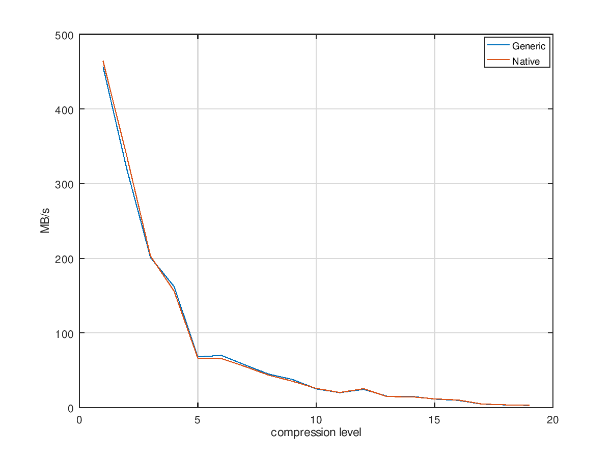

Zstd test results
===

### [amd64] generic / native, zstd benchmark

Generic version: `zstd/unstable,unstable,now 1.3.5+dfsg-1`
Optimized version: `zstd/now 1.3.5+dfsg-1+simd.skylake`



Generic result
```
~ ❯❯❯ zstd -b1 -e19
- test >= 3 seconds per compression / decompression - 
Benchmarking levels from 1 to 19
 1#Synthetic 50%     :  10000000 ->   3139167 (3.186), 456.3 MB/s ,1693.8 MB/s 
 2#Synthetic 50%     :  10000000 ->   3115142 (3.210), 319.6 MB/s ,1612.1 MB/s 
 3#Synthetic 50%     :  10000000 ->   3222676 (3.103), 201.3 MB/s ,1264.2 MB/s 
 4#Synthetic 50%     :  10000000 ->   3313085 (3.018), 162.1 MB/s ,1135.5 MB/s 
 5#Synthetic 50%     :  10000000 ->   3278023 (3.051),  68.0 MB/s ,1100.0 MB/s 
 6#Synthetic 50%     :  10000000 ->   3311431 (3.020),  69.9 MB/s ,1073.8 MB/s 
 7#Synthetic 50%     :  10000000 ->   3302083 (3.028),  57.1 MB/s ,1083.5 MB/s 
 8#Synthetic 50%     :  10000000 ->   3306698 (3.024),  44.8 MB/s ,1065.6 MB/s 
 9#Synthetic 50%     :  10000000 ->   3310350 (3.021),  37.7 MB/s ,1049.2 MB/s 
10#Synthetic 50%     :  10000000 ->   3313086 (3.018),  25.2 MB/s ,1022.0 MB/s 
11#Synthetic 50%     :  10000000 ->   3313318 (3.018),  20.0 MB/s ,1034.5 MB/s 
12#Synthetic 50%     :  10000000 ->   3344827 (2.990),  24.5 MB/s , 989.6 MB/s 
13#Synthetic 50%     :  10000000 ->   3343890 (2.991),  15.2 MB/s , 986.3 MB/s 
14#Synthetic 50%     :  10000000 ->   3343817 (2.991),  15.3 MB/s , 995.0 MB/s 
15#Synthetic 50%     :  10000000 ->   3343215 (2.991),  11.4 MB/s , 903.8 MB/s 
16#Synthetic 50%     :  10000000 ->   3067584 (3.260),  9.74 MB/s ,1454.4 MB/s 
17#Synthetic 50%     :  10000000 ->   3129998 (3.195),  4.64 MB/s ,1202.0 MB/s 
18#Synthetic 50%     :  10000000 ->   3130748 (3.194),  3.64 MB/s ,1195.6 MB/s 
19#Synthetic 50%     :  10000000 ->   3131274 (3.194),  2.90 MB/s ,1238.8 MB/s 
```

Optimized result
```
~ ❯❯❯ zstd -b1 -e19
- test >= 3 seconds per compression / decompression - 
Benchmarking levels from 1 to 19
 1#Synthetic 50%     :  10000000 ->   3139167 (3.186), 464.2 MB/s ,1728.4 MB/s 
 2#Synthetic 50%     :  10000000 ->   3115142 (3.210), 337.0 MB/s ,1710.1 MB/s 
 3#Synthetic 50%     :  10000000 ->   3222676 (3.103), 203.1 MB/s ,1222.3 MB/s 
 4#Synthetic 50%     :  10000000 ->   3313085 (3.018), 155.9 MB/s ,1084.4 MB/s 
 5#Synthetic 50%     :  10000000 ->   3278023 (3.051),  66.4 MB/s ,1061.5 MB/s 
 6#Synthetic 50%     :  10000000 ->   3311431 (3.020),  65.7 MB/s ,1024.4 MB/s 
 7#Synthetic 50%     :  10000000 ->   3302083 (3.028),  55.0 MB/s ,1022.1 MB/s 
 8#Synthetic 50%     :  10000000 ->   3306698 (3.024),  43.4 MB/s ,1000.6 MB/s 
 9#Synthetic 50%     :  10000000 ->   3310350 (3.021),  35.3 MB/s , 964.1 MB/s 
10#Synthetic 50%     :  10000000 ->   3313086 (3.018),  25.8 MB/s , 965.5 MB/s 
11#Synthetic 50%     :  10000000 ->   3313318 (3.018),  20.2 MB/s , 976.4 MB/s 
12#Synthetic 50%     :  10000000 ->   3344827 (2.990),  25.4 MB/s , 926.2 MB/s 
13#Synthetic 50%     :  10000000 ->   3343890 (2.991),  14.7 MB/s , 911.5 MB/s 
14#Synthetic 50%     :  10000000 ->   3343817 (2.991),  14.6 MB/s , 910.7 MB/s 
15#Synthetic 50%     :  10000000 ->   3343215 (2.991),  11.7 MB/s , 913.3 MB/s 
16#Synthetic 50%     :  10000000 ->   3067584 (3.260),  10.2 MB/s ,1491.8 MB/s 
17#Synthetic 50%     :  10000000 ->   3129998 (3.195),  4.84 MB/s ,1230.7 MB/s 
18#Synthetic 50%     :  10000000 ->   3130748 (3.194),  3.75 MB/s ,1226.6 MB/s 
19#Synthetic 50%     :  10000000 ->   3131274 (3.194),  3.05 MB/s ,1194.3 MB/s 
```


```
lumin AT debian.org, CC-BY-SA 4.0
```
